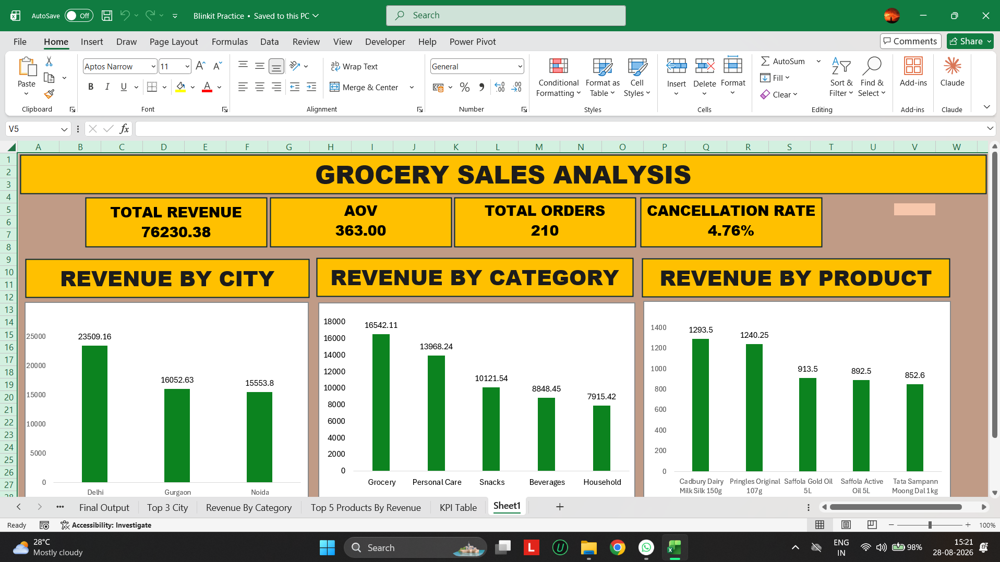
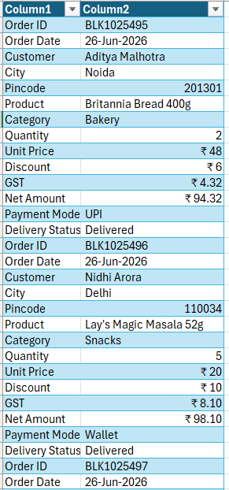
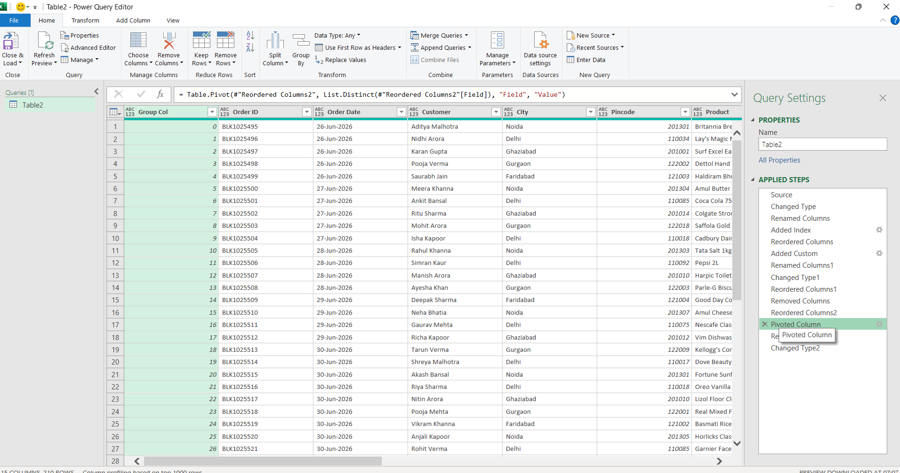
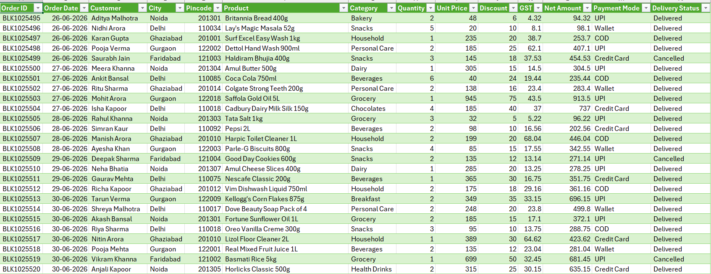
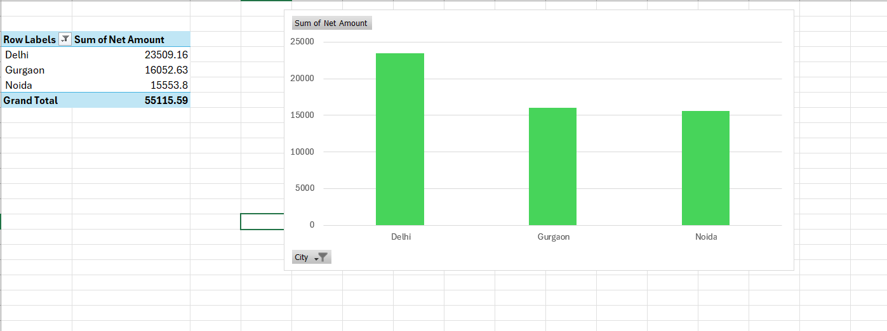

# grocery-sales-analysis-excel
Excel &amp; Power Query project for cleaning, transforming and analyzing grocery seller sales data.
# 📊 Grocery Sales Analysis using Excel & Power Query

## 📌 Project Overview

This project demonstrates the complete process of cleaning, transforming
and analyzing grocery seller order data using Microsoft Excel and
Power Query.

The raw dataset was provided in an unstructured key-value format where
each order was represented across multiple rows.

The objective was to transform the raw data into a structured,
analysis-ready dataset and generate useful business insights using
Excel.

---

## 🛠️ Tools & Skills

- Microsoft Excel
- Power Query
- Pivot Tables
- Pivot Charts
- Data Cleaning
- Data Transformation
- Data Analysis
- Dashboard Creation

---

## 🔄 Data Cleaning & Transformation Process

The following workflow was used:

Raw Data
↓
Excel Table
↓
Power Query
↓
Add Index
↓
Group Records
↓
Pivot Attributes
↓
Data Type Conversion
↓
Clean Dataset
↓
Pivot Table Analysis
↓
Dashboard

### Power Query Transformation

The raw dataset contained 14 attributes for each order.

An Index Column was added and the records were grouped based on the
14-row structure of each order. The attribute column was then pivoted
to reconstruct each order into a single row.

The resulting dataset was cleaned and loaded back into Microsoft Excel
for analysis.

---

## 📊 Dashboard

The final dashboard includes:

- Total Revenue
- Average Order Value
- Total Orders
- Cancellation Rate
- Revenue by City
- Revenue by Category
- Revenue by Product

---

## 📈 Key Results

| KPI | Result |
|---|---:|
| Total Revenue | ₹76,230.38 |
| Total Orders | 210 |
| Average Order Value | ₹363.00 |
| Cancellation Rate | 4.76% |

---

## 📊 Analysis Performed

### Revenue by City

The analysis identified the top cities by revenue:

| City | Revenue |
|---|---:|
| Delhi | ₹23,509.16 |
| Gurgaon | ₹16,052.63 |
| Noida | ₹15,553.80 |

### Delivery Performance

| Delivery Status | Orders | Net Amount |
|---|---:|---:|
| Delivered | 200 | ₹71,960.26 |
| Cancelled | 10 | ₹4,270.12 |

The overall delivery rate was 95.24%, while the cancellation rate
was 4.76%.

---

## 💡 Business Insights

- Delhi generated the highest revenue among the analyzed cities.
- Grocery was the highest-revenue category in the analysis.
- 200 of 210 orders were delivered.
- 10 orders were cancelled.
- The average order value was approximately ₹363.
- Cancelled orders represented ₹4,270.12 in order value.

---

## 📷 Project Screenshots

### 1. Raw Data

### 2. Power Query Transformation

### 3. Cleaned Dataset

### 4. Pivot Table Analysis

### 5. Final Dashboard

---

## ⚠️ Data Disclaimer

This is a fictional/practice dataset created for educational and
portfolio purposes.

It is not official Blinkit data and should not be interpreted as
actual Blinkit business information.

---

## 🎯 Learning Outcome

This project helped me practice the complete Excel data-analysis
workflow:

Raw Data → Data Cleaning → Data Transformation → Analysis →
Visualization → Dashboard
